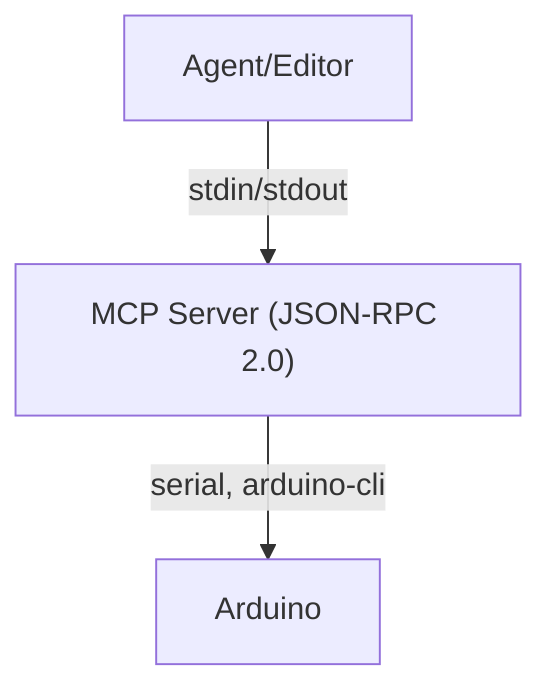

# Arduino MCP Server (Model Context Protocol)

A robust, secure, and extensible server for controlling Arduino devices via the Model Context Protocol (MCP) using JSON-RPC 2.0 over stdin/stdout. Designed for agent-driven workflows, automation, and seamless integration with editors like VSCode and Cursor.

---

## Table of Contents
- [Overview](#overview)
- [Architecture](#architecture)
- [Installation](#installation)
- [Configuration](#configuration)
- [Usage](#usage)
  - [CLI](#cli)
  - [VSCode/Cursor Integration](#vscodecursor-integration)
  - [Scripting/Automation](#scriptingautomation)
  - [Docker](#docker)
- [Protocol](#protocol)
- [Testing](#testing)
  - [Unit Tests](#unit-tests)
  - [Integration Tests](#integration-tests)
- [Example Arduino Sketches](#example-arduino-sketches)
- [Troubleshooting](#troubleshooting)
- [Extensibility](#extensibility)
- [FAQ](#faq)

---

## Overview

The MCP server provides a secure, scriptable, and extensible interface for compiling, uploading, and communicating with Arduino devices. It is ideal for:
- Automated device programming
- Agent-driven workflows
- Editor/IDE integration
- Robust, testable hardware development

## Architecture

- **Language:** Python 3.10+
- **Dependency Management:** Poetry (`pyproject.toml`)
- **Project Layout:**
  - `src/arduino_mcp_server/` — Main server code (FastMCP-based)
  - `sketches/` — Example/test Arduino sketches
  - `tests/unit/` — Fast, mocked unit tests (no hardware)
  - `tests/integration/` — Hardware-dependent integration tests
- **Protocol:** JSON-RPC 2.0 over line-delimited stdin/stdout
- **Containerization:** Dockerfile for easy deployment and USB access



## Installation

1. **Install Poetry:**
   ```bash
   curl -sSL https://install.python-poetry.org | python3 -
   ```
2. **Clone and install dependencies:**
   ```bash
   git clone <your-repo-url>
   cd arduino-mcp-example
   poetry install
   ```

## Configuration
- No special configuration is required for basic use.
- All actions are parameterized via JSON-RPC requests.
- For custom board FQBNs or ports, specify them in your requests.

## Usage

### CLI
Run the server and send requests via pipes:
```bash
echo '{"jsonrpc": "2.0", "id": 1, "method": "list_ports", "params": {}}' | poetry run python -m arduino_mcp_server.server
```

### VSCode/Cursor/Claude Desktop Integration
1. **Add `.vscode/mcp.json`:**
   ```json
   {
     "mcp": {
       "servers": {
         "arduino": {
           "type": "stdio",
           "command": "poetry",
           "args": ["run", "arduino-mcp-server"],
           "env": {
             "LOG_LEVEL": "INFO",
             "ARDUINO_CLI_PATH": "/usr/local/bin/arduino-cli"
           }
         }
       }
     }
   }
   ```
2. **Restart your editor.** MCP-aware clients will auto-discover and launch the server.

### Scripting/Automation
You can use Python, Node.js, or any language to send JSON-RPC requests to the MCP server’s stdin and parse responses from stdout.

#### Example Python Script
```python
import subprocess
import json
req = {"jsonrpc": "2.0", "id": 1, "method": "list_ports", "params": {}}
proc = subprocess.Popen(["poetry", "run", "python", "-m", "arduino_mcp_server.server"], stdin=subprocess.PIPE, stdout=subprocess.PIPE, text=True)
stdout, _ = proc.communicate(json.dumps(req) + "\n")
print(json.loads(stdout))
```

### Docker
Run the MCP server in a container with all dependencies and USB permissions:
```bash
docker build -t arduino-mcp-server .
docker run --rm --device=/dev/ttyACM0 --env LOG_LEVEL=INFO arduino-mcp-server
```
- For macOS, use `/dev/cu.usbmodem*` as the device.
- You may need to adjust device permissions or add your user to the `dialout` group on Linux.

## Protocol
- **Transport:** Line-delimited JSON-RPC 2.0 over stdin/stdout
- **Request Example:**
  ```json
  {
    "jsonrpc": "2.0",
    "id": 1,
    "method": "compile",
    "params": {"sketch": "sketches/echo_serial/echo_serial.ino", "fqbn": "arduino:renesas_uno:unor4wifi"}
  }
  ```
- **Response Example:**
  ```json
  {
    "jsonrpc": "2.0",
    "result": {
      "version": "1.0",
      "data": {"success": true, "stdout": "...", "stderr": "..."}
    },
    "id": 1
  }
  ```
- **Actions:**
  - `list_ports`: List available serial ports
  - `compile`: Compile a sketch
  - `upload`: Upload a compiled sketch
  - `serial_send`: Send a message over serial and receive a response
  - `read_serial`: Read lines from serial port with overall timeout

## Testing

### Unit Tests
- Located in `tests/unit/`
- Run with:
  ```bash
  poetry run test-unit
  ```
- Fast, require no hardware (use mocks)

### Integration Tests
- Located in `tests/integration/`
- Run with:
  ```bash
  poetry run test-integration
  ```
- Require a connected Arduino and real sketches

## Example Arduino Sketches
- `sketches/echo_serial/echo_serial.ino`: Echoes serial input with a unique prefix
- `sketches/status_reporter/status_reporter.ino`: Periodically prints status messages
- `sketches/command_feedback/command_feedback.ino`: Responds to commands with unique feedback

## Troubleshooting
- **Poetry not found:** Install with the command above
- **No serial ports found:** Check your Arduino connection and permissions
- **Tests fail:** Ensure you are running the correct suite (unit vs. integration)
- **Permission errors:** Try running with `sudo` or adjust group membership for serial devices
- **Arduino not detected:** Check cable, port, and board type
- **Docker USB issues:** Use `--device` flag and ensure your user has access to the device

## Extensibility
- Add new actions by extending `src/arduino_mcp_server/server.py` and registering with FastMCP
- Add new sketches to `sketches/` for richer device feedback
- Add more unit/integration tests as needed

## FAQ

**Q: Can I use this with other microcontrollers?**
A: Yes, as long as they support serial and can be programmed via arduino-cli or similar tools.

**Q: How do I add a new board type?**
A: Specify the correct FQBN in your JSON-RPC requests.

**Q: Can I use this in CI/CD?**
A: Yes! Use Poetry, Docker, and the CLI to automate tests and device programming.

**Q: How do I get help or contribute?**
A: Open an issue or PR on the repository.

---

For more advanced integration, scripting, or agent-driven workflows, see the code and comments in `src/arduino_mcp_server/server.py`. 